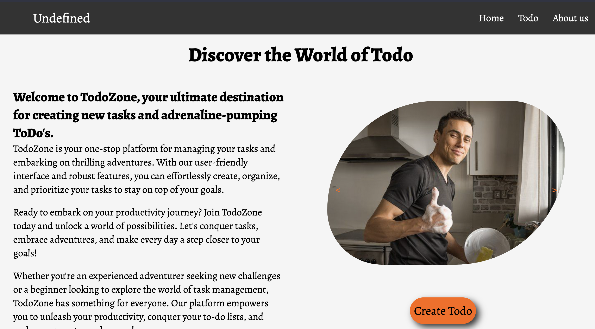
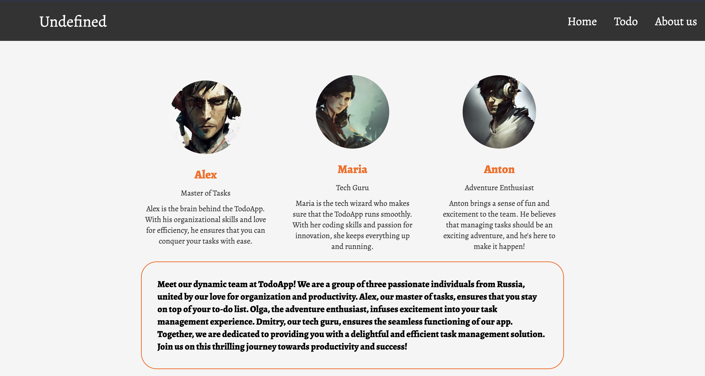
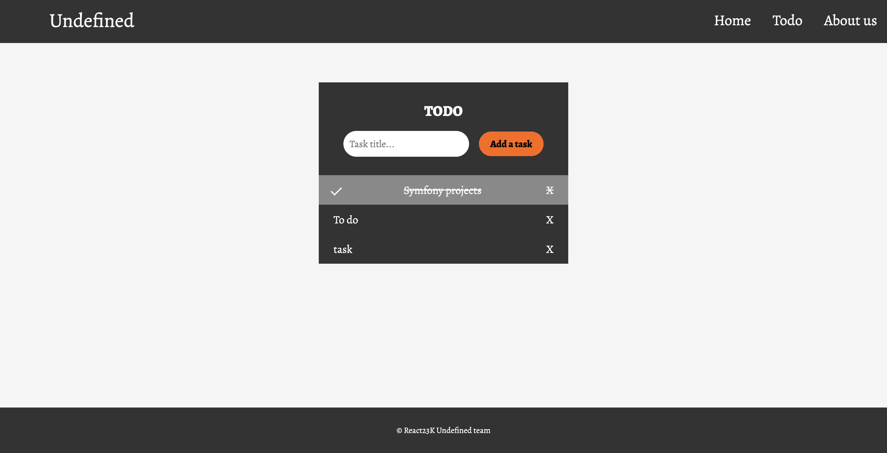

# Symfony mini-projects

## Task 1

### Basic website using Symfony 6

The home page with information about Undefind team looks like:

The About us page gives information about Alex, Maria and Anton:

### To-Do App using Symfony and MySQL

The Todo page contains To-Do App, where you can add, delete, update and check tasks.

GitHub link:

